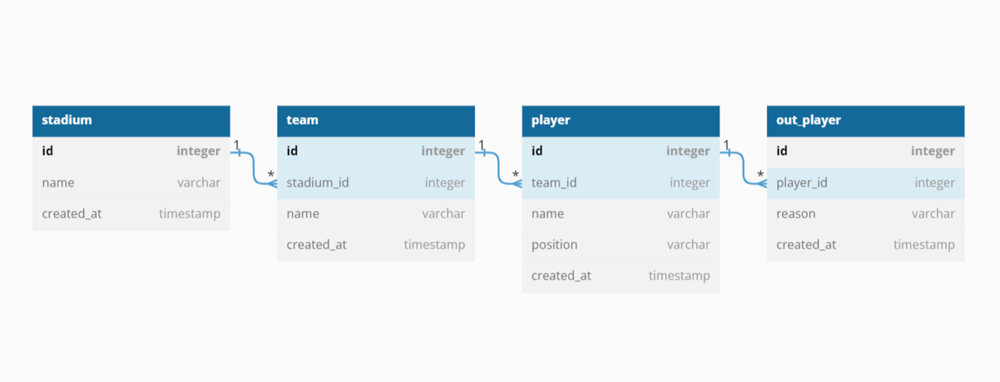

# KDTBE5_Spring_ToyProject
야구 관리 프로그램 토이 프로젝트

## 🕰️ 기간

- 23.06.26 ~ 23.06.30 (5일)

## ⚙️ 개발 환경

- Java 11
- gradle
- lombok
- JDBC
- MySQL

## 프로젝트 체크리스트

1. 😀테이블과 모델 설계
    - 야구관리 프로그램을 위한 테이블을 설계한다(PK, FK, UK 제약조건 확인).
    - 야구관리 프로그램을 위한 적절한 테이블의 필드가 구성되어 있다.
    - 테이블 정보(컬럼명, 타입, pk여부 등), ERD 정리
2. 😁Service 생성
    - 모든 기능에 대한 요청을 콘솔을 통해 입력받는다.
    - 요청에 맞는 서비스에 메서드가 적절히 실행된다.
    - Scanner로 요청하는 모든 문자열을 파싱하는 메서드를 만들고 사용한다.
3. 😂DAO 생성
    - 데이터베이스에 접근하는 DAO를 싱글톤 패턴으로 구현하였다.
    - 쿼리로 해결할 수 있는 응답정보는 쿼리로 해결하였다. ex) 포지션별 팀 야구 선수 페이지를 Pivot을 사용하였다
    - DAO에서 디비로 부터 조회된 데이터를 DTO or Model에 옮길 수 있다.
4. 🤣기능 확인
    - 야구장 등록, 야구장 목록보기.
    - 팀 등록, 팀 목록보기
    - 선수 등록, 팀별 선수 목록
    - 선수 퇴출 등록, 선수 퇴출 목록
    - 포지션별 팀 야구 선수 페이지
5. 😃완성도
    - DAO에서 예외 처리를 하고 있다
    - 변수명, 메서드명 작성시 일관성이 있다 (코드 컨벤션이 있다)
    - 선수 퇴출 등록시에 트랜잭션 처리를 하고 있다 (Begin Transaction ~)
    - 선수 퇴출 등록시에 reason 칼럼에 대한 Enum이 구현되어 있다
---

## 🙍‍ 역할 분담
### `박성현`
- 선수 등록, 팀별 선수 목록
- 선수 퇴출 등록, 선수 퇴출 목록
- DB Connection
- 스캐너 입력
- 리플렉션
- 예외 처리

### `선예은`
- 야구장 등록, 야구장 목록보기.
- 팀 등록, 팀 목록보기
- 포지션별 팀 야구 선수 페이지
- 예외 처리
---

## 📝 DB설계
### 1. DB 생성

```sql
create database baseball;
```
---
### 2. 테이블 생성 쿼리

#### 2-1. stadium

```sql
create table stadium (
    id int not null auto_increment primary key,
    name varchar(30) not null,
    created_at timestamp default current_timestamp
) Engine=InnoDB default charset=utf8mb4;
```

#### 2-2. team
```sql
create table team (
    id int not null auto_increment primary key,
   stadium_id int not null,
    name varchar(30) not null,
    created_at timestamp default current_timestamp,
    foreign key(stadium_id) references stadium(id)
) Engine=InnoDB default charset=utf8mb4;
```

#### 2-3. player
```sql
create table player (
    id int not null auto_increment primary key,
    team_id int,
    name varchar(30) not null,
    position varchar(30) not null,
    created_at timestamp default current_timestamp,
    foreign key(team_id) references team(id),
    unique(team_id, position)
) Engine=InnoDB default charset=utf8mb4;
```

#### 2-4. out_player
```sql
create table out_player (
    id int not null auto_increment primary key,
    player_id int not null,
    reason varchar(50) not null,
    created_at timestamp default current_timestamp,
    foreign key(player_id) references player(id)
) Engine=InnoDB default charset=utf8mb4;
```
---

### 3. ERD


---
## 🖥️ 기능 목록

### 1. 야구장 등록
>요청 : 야구장등록?name=잠실야구장
> 
>응답 : 성공이라는 메시지를 출력한다.

### 2. 전체 야구장 목록보기
>요청 : 야구장목록
>
>응답 : 야구장 목록은 Model -> Stadium을 List에 담아서 출력한다.

### 3. 팀 등록
>요청 : 팀등록?stadiumId=1&name=NC
>
>응답 : 성공이라는 메시지를 출력한다.

### 4. 전체 팀 목록
>요청 : 팀목록
>
>응답 : 팀 목록은 Stadium 정보를 조인해서 출력해야 된다. TeamRespDTO가 필요하다.

### 5. 선수 등록
>요청 : 선수등록?teamId=1&name=이대호&position=1루수
>
>응답 : 성공이라는 메시지를 출력한다.

### 6. 팀별 선수 목록
>요청 : 선수목록?teamId=1
>
>응답 : 선수 목록은 Model -> Player를 List에 담아서 출력한다. (team_id는 출력하지 않아도 된다)

### 7. 선수 퇴출 등록
>요청 : 퇴출등록?playerId=1&reason=도박
>
>응답 : 성공이라는 메시지를 출력한다.

### 8. 선수 퇴출 목록
>요청 : 퇴출목록
>
>응답 : OutPlayerRespDTO에 담아서 출력한다.

### 9. 포지션별 팀 야구 선수 페이지
>요청 : 포지션별목록
>
>응답 : PositionRespDto에 값을 담아서 콘솔에 출력한다.